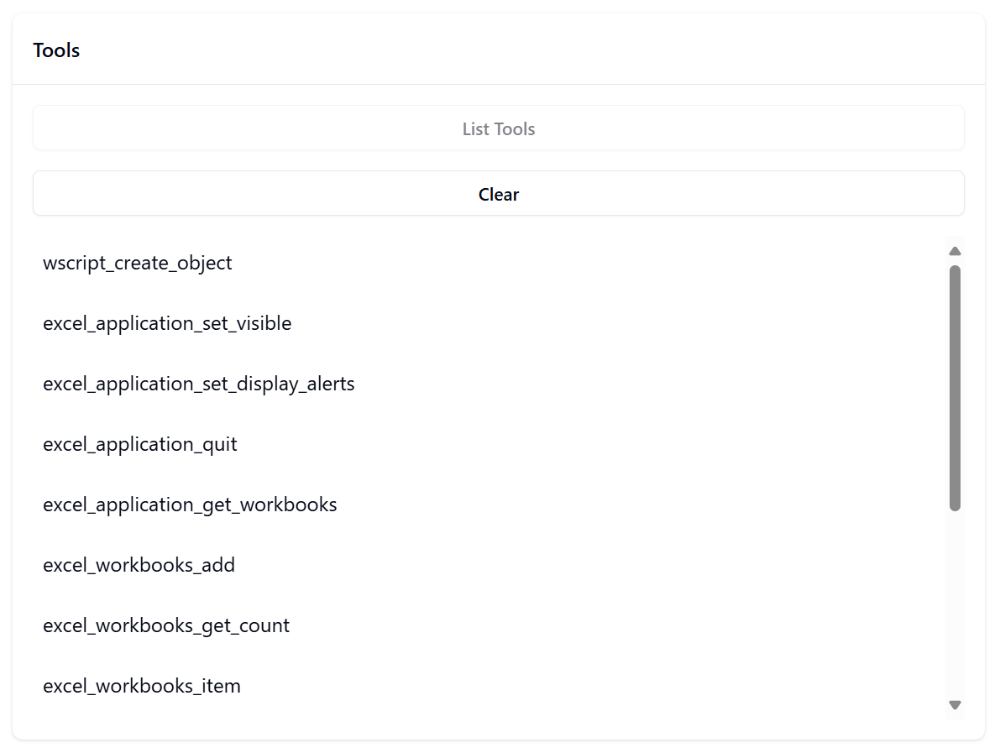
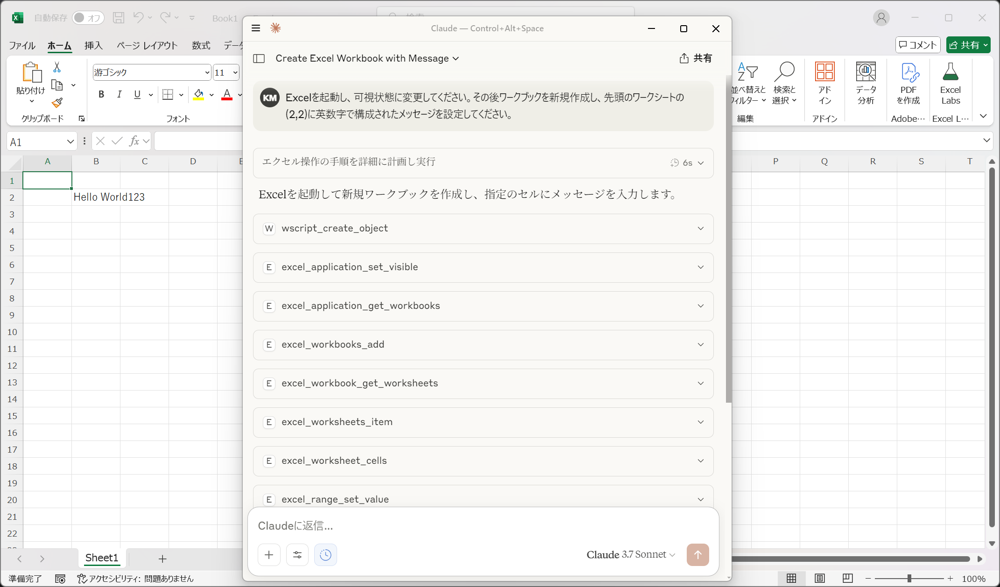

# WSH JScriptでMCPサーバーを作成し、Excelを操作させる

MCPはJSON-RPCを用いており、標準入出力でやりとりする場合は改行区切りです[^stdio-delimiter]。この程度であれば、Microsoft WindowsにプリインストールされているJScriptでも実装できそうです。もっとも、MCPクライアントを用意できる環境ならNode.jsなど、より適したツールをインストールできるでしょうから、なにか特に実用的というわけではありませんが。

[^stdio-delimiter]: https://modelcontextprotocol.io/specification/2025-03-26/basic/transports?utm_source=chatgpt.com#stdio

WSHで作成するならCOMを活用するのが面白いでしょう。今回はExcelを操作させてみます。

まずはツールとして公開する機能を考えます。JScriptからオブジェクト自体を返すのは難しいため、オブジェクトをプールに登録して、そのIDを返す実装にしました。メソッド／プロパティにあたるツールを実行する際は毎回IDを引数として渡します。

```javascript
function generateUUID() {
  // ...
}

/** @type {{[key:UUID]:unknown}} */
var pool = {};
/**
 * @param {unknown} obj
 */
function addToPool(obj) {
  var uuid = generateUUID();
  while (pool.hasOwnProperty(uuid)) {
    uuid = generateUUID();
  }
  pool[uuid] = obj;
  return uuid;
}

/**
 * @typedef {UUID&{__excelApplicationBrand:never}} ExcelApplicationID
 * @typedef {UUID&{__excelWorkbooksBrand:never}} ExcelWorkbooksID
 * @typedef {UUID&{__excelWorkbookBrand:never}} ExcelWorkbookID
 * @typedef {UUID&{__excelWorksheetsBrand:never}} ExcelWorksheetsID
 * @typedef {UUID&{__excelWorksheetBrand:never}} ExcelWorksheetID
 * @typedef {UUID&{__excelRangeBrand:never}} ExcelRangeID
 */

/**
 * @overload
 * @param {"Excel.Application"} progId
 * @returns {ExcelApplicationID}
 */
/**
 * @param {string} progId
 * @returns {UUID}
 */
function wscriptCreateObject(progId) {
  return addToPool(WScript.CreateObject(progId));
}

/**
 * https://learn.microsoft.com/office/vba/api/excel.application.quit
 * @param {ExcelApplicationID} excelApplicationId
 */
function excelApplicationQuit(excelApplicationId) {
  // @ts-ignore
  pool[excelApplicationId].Quit();
}

// ...

function test() {
  var excel = wscriptCreateObject("Excel.Application");
  try {
    excelApplicationSetVisible(excel, true);

    var workbooks = excelApplicationGetWorkbooks(excel);
    excelWorkbooksAdd(workbooks);
    if (excelWorkbooksGetCount(workbooks) !== 1) {
      throw new Error(
        "Assertion failed: excelWorkbooksGetCount(workbooks) !== 1"
      );
    }

    var workbook = excelWorkbooksItem(workbooks, 1);
    var worksheets = excelWorkbookGetWorksheets(workbook);
    if (excelWorksheetsGetCount(worksheets) !== 1) {
      throw new Error(
        "Assertion failed: excelWorksheetsGetCount(worksheets) !== 1"
      );
    }
    var worksheet = excelWorksheetsItem(worksheets, 1);

    var cell = excelWorksheetCells(worksheet, 1, 1);
    excelRangeSetValue(cell, "foo");
    if (excelRangeGetValue(cell) !== "foo") {
      throw new Error('Assertion failed: excelRangeGetValue(cell) !== "foo"');
    }
  } finally {
    excelApplicationSetDisplayAlerts(excel, false);
    excelApplicationQuit(excel);
  }
}
```

続いて最小限のMCPサーバー実装を作成します。`npx @modelcontextprotocol/inspector cscript //E:JScript //Nologo server.js`コマンドで動作を観察しながら実装を進めていきます。

```javascript
Function("return this")().JSON = {
  parse: function (sJSON) {
    return eval("(" + sJSON + ")");
  },
  stringify: (function () {
    // ...
  })()
};

/**
 * https://github.com/modelcontextprotocol/modelcontextprotocol/blob/c87a0da6d8c2436d56a6398023c80b0562224454/schema/2024-11-05/schema.ts#L9
 * @constant
 * @type {"2.0"}
 */
var JSONRPC_VERSION = "2.0";
/**
 * https://github.com/modelcontextprotocol/modelcontextprotocol/blob/c87a0da6d8c2436d56a6398023c80b0562224454/schema/2024-11-05/schema.ts#L8
 * @constant
 * @type {"2024-11-05"}
 */
var LATEST_PROTOCOL_VERSION = "2024-11-05";

/**
 * https://github.com/modelcontextprotocol/modelcontextprotocol/blob/c87a0da6d8c2436d56a6398023c80b0562224454/schema/2024-11-05/schema.ts#L83
 * @constant
 * @type {-32700}
 */
var PARSE_ERROR = -32700;
var INVALID_REQUEST = -32600;
var METHOD_NOT_FOUND = -32601;
var INVALID_PARAMS = -32602;
var INTERNAL_ERROR = -32603;

/**
 * @param {string} level
 * @param {string} message
 */
function log(level, message) {
  WScript.StdErr.WriteLine(
    "[" + new Date().toString() + "]\t[" + level + "]\t" + message
  );
}

/**
 * @param {unknown} id
 * @param {Record<string,unknown>} response
 */
function respond(id, response) {
  response.jsonrpc = JSONRPC_VERSION;
  /**
   * FIXME
   * https://github.com/modelcontextprotocol/modelcontextprotocol/blob/c87a0da6d8c2436d56a6398023c80b0562224454/schema/2024-11-05/schema.ts#L56
   */
  response.id = typeof id === "number" || typeof id === "string" ? id : "";

  var str = JSON.stringify(response);
  WScript.StdOut.WriteLine(str);
  log("debug", str);
}

/**
 * @constant
 * @type {{name:"jscript-excel-mcp-server";version:"0.1.0";}}
 */
var SERVER_INFO = {
  name: "jscript-excel-mcp-server",
  version: "0.1.0"
};

(function main() {
  while (!WScript.StdIn.AtEndOfStream) {
    var line = WScript.StdIn.ReadLine();
    /** @type {Record<string,unknown>} */
    var request = {};
    try {
      request = JSON.parse(line);
    } catch (e) {
      respond(request.id, {
        error: {
          code: PARSE_ERROR,
          message: "PARSE_ERROR: " + (e instanceof Error && e.message) || ""
        }
      });
      continue;
    }

    // https://github.com/modelcontextprotocol/modelcontextprotocol/blob/c87a0da6d8c2436d56a6398023c80b0562224454/schema/2024-11-05/schema.ts#L21
    if (typeof request.method !== "string") {
      respond(request.id, {
        error: {
          code: INVALID_REQUEST,
          message: "INVALID_REQUEST: " + JSON.stringify(request)
        }
      });
      continue;
    }

    switch (request.method) {
      case "initialize":
        respond(request.id, {
          result: {
            protocolVersion: LATEST_PROTOCOL_VERSION,
            capabilities: { tools: {} },
            serverInfo: SERVER_INFO
          }
        });
        break;

      default:
        respond(request.id, {
          error: {
            code: METHOD_NOT_FOUND,
            message: "METHOD_NOT_FOUND: " + JSON.stringify(request)
          }
        });
    }
  }
})();
```

起点となる[`InitializeRequest`/`InitializeResult`](https://github.com/modelcontextprotocol/modelcontextprotocol/blob/c87a0da6d8c2436d56a6398023c80b0562224454/schema/2024-11-05/schema.ts#L148-L176)の処理をあらかじめ作成しました。MCP Inspectorで［Connect］をクリックすると、［Error output from MCP server］に以下のようなログメッセージが表示されるはずです。

```
[Wed May 21 00:14:04 UTC+0900 2025] [debug] {"result": {"protocolVersion": "2024-11-05", "capabilities": {"tools": {}}, "serverInfo": {"name": "jscript-excel-mcp-server", "version": "0.1.0"}}, "jsonrpc": "2.0", "id": 0}
[Wed May 21 00:14:04 UTC+0900 2025] [debug] {"error": {"code": -32601, "message": "METHOD_NOT_FOUND: {\"jsonrpc\": \"2.0\", \"method\": \"notifications/initialized\"}"}, "jsonrpc": "2.0", "id": ""}
```

1行目で、実装した`InitializeRequest`への応答が正しく処理されていることがわかります。続いて2行目では`METHOD_NOT_FOUND`エラーが発生していますが、今回は簡易的な実装なので`"notifications/*"`のリクエストは無視することにします。

MCP Inspectorで［List Tools］をクリックします。

```
[Wed May 21 00:18:15 UTC+0900 2025] [debug] {"error": {"code": -32601, "message": "METHOD_NOT_FOUND: {\"jsonrpc\": \"2.0\", \"id\": 1, \"method\": \"tools/list\", \"params\": {\"_meta\": {\"progressToken\": 1}}}"}, "jsonrpc": "2.0", "id": 1}
```

`"tools/list"`に対応する応答を実装しましょう。スキーマでは[`ListToolsRequest`/`ListToolsResult`](https://github.com/modelcontextprotocol/modelcontextprotocol/blob/c87a0da6d8c2436d56a6398023c80b0562224454/schema/2024-11-05/schema.ts#L635-L644)と定義されています。ツールがひとつもなければ以下の記述だけでエラーは解消されます。

```javascript
switch (request.method) {
  // ...

  case "tools/list":
    respond(request.id, {
      result: {
        tools: []
      }
    });
    break;

  // ...
}
```

公開するツールごとに[`Tool`](https://github.com/modelcontextprotocol/modelcontextprotocol/blob/c87a0da6d8c2436d56a6398023c80b0562224454/schema/2024-11-05/schema.ts#L687-L707)オブジェクトを追加していきます。

```javascript
var TOOLS = [
  {
    name: "wscript_create_object",
    inputSchema: {
      type: "object",
      properties: {
        progId: { type: "string" }
      },
      required: ["progId"]
    }
  },
  {
    name: "excel_application_set_visible",
    inputSchema: {
      type: "object",
      properties: {
        excelApplicationId: { type: "string" },
        value: { type: "boolean" }
      },
      required: ["excelApplicationId", "value"]
    }
  }

  // ...
];
```



［Tools］に列挙されたツールを選択し、引数を入力して［Run Tool］をクリックすると、次のようなエラーが表示されます。

```
"MCP error -32601: METHOD_NOT_FOUND: {"jsonrpc": "2.0", "id": 2, "method": "tools/call", "params": {"_meta": {"progressToken": 2}, "name": "wscript_create_object", "arguments": {"progId": "Excel.Application"}}}"
```

`"tools/call"`に対応する応答を実装します。スキーマでは[`CallToolRequest`/`CallToolResult`](https://github.com/modelcontextprotocol/modelcontextprotocol/blob/c87a0da6d8c2436d56a6398023c80b0562224454/schema/2024-11-05/schema.ts#L646-L678)として定義されています。

```javascript
/**
 * @constant
 */
var HANDLERS = {
  wscript_create_object: function (args) {
    return wscriptCreateObject(args["progId"]);
  },
  excel_application_set_visible: function (args) {
    return excelApplicationSetVisible(
      args["excelApplicationId"],
      args["value"]
    );
  },
  excel_application_set_display_alerts: function (args) {
    return excelApplicationSetDisplayAlerts(
      args["excelApplicationId"],
      args["value"]
    );
  }

  // ...
};

switch (request.method) {
  // ...

  case "tools/call":
    if (
      typeof request.params !== "object" ||
      request.params === null ||
      typeof request.params["name"] !== "string"
    ) {
      respond(request.id, {
        error: {
          code: INVALID_PARAMS,
          message: "INVALID_PARAMS: " + JSON.stringify(request)
        }
      });
      break;
    }

    try {
      var ret = HANDLERS[request.params["name"]](request.params["arguments"]);
      respond(request.id, {
        result: {
          content: [
            {
              type: "text",
              text: JSON.stringify(ret)
            }
          ]
        }
      });
    } catch (e) {
      respond(request.id, {
        result: {
          content: [
            {
              type: "text",
              message: (e instanceof Error && e.message) || ""
            }
          ],
          isError: true
        }
      });
    }
    break;

  // ...
}
```

これで、MCP Inspectorからツールを呼び出すまでの一連のやりとりを実装できました。実際にClaude Desktopで使用する場合は、設定ファイルに次のように指定します。

```json
{
  "mcpServers": {
    "jscript-excel-mcp-server": {
      "command": "cscript",
      "args": [
        "//E:JScript",
        "//Nologo", 
        "<path_to>\\server.js"
      ]
    }
  }
}
```

試してみたところ、日本語は正しく送受信できないようです。文字コードの都合だったと記憶しています。


